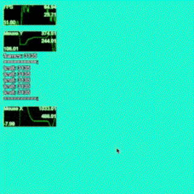

# p5js-debugWindow

Auto updating values and graphs for p5js.


<hr>

## Usage
You just need the `debugWindow.js` includede in your html file.
 - requires `p5.js v1.9.2`

```js
let debugWindow;
function setup() {
    createCanvas(500, 500);

    /*
    debugWindow = new DebugWindow(x, y, w, h, fontSize = 14);
    debugWindow.add(
        label, 
        valueRef, 
        isGraph = false, 
        code = "default", 
        order = 0
    );
    */

    debugWindow = new DebugWindow(0, 0, 150, height);
    //debugWindow.padding = 10;
    //debugWindow.lineHeight = 1;
    //debugWindow.fontSize = 14;
    //debugWindow.removeAll();
    

    //static
    debugWindow.add("Static Label", "69");
    //changes the value automaticly
    debugWindow.add("Mouse X", () => mouseX);

    //graph
    debugWindow.add("Mouse Y", () => mouseY, true);

    //graph that you can remove later
    debugWindow.add("FPS", () => frameRate(), true, "fpsGraph");
    debugWindow.remove("fpsGraph");

    //place this at bottom
    debugWindow.add("==========", "", false, "default", 999);
    //place this at top
    debugWindow.add("==========", "", false, "default", -999); 
    
    //you can call these from draw() too
}

function draw(){
    background(255);

    //update and paste the graphics on the screen
    debugWindow.display(); 

    //or
    
    //manually draw it
    debugWindow.update();
    image(debugWindow.g, 0, 0, width, height);
}
```
<hr>
code is bad, unoptimized and not scalable. it helps me tho. 